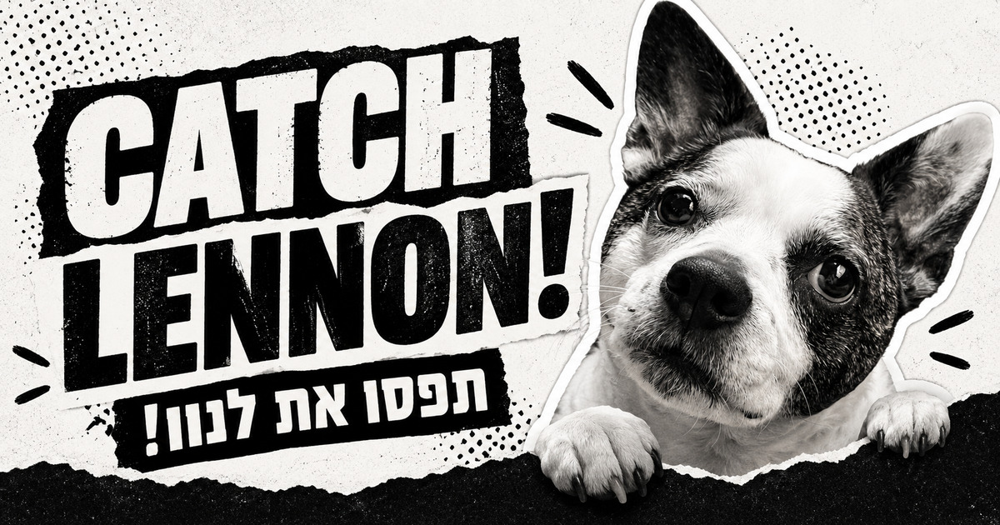

<div align="center">



<br>

# CATCH LENNON!

### תפסו את לנון! · ПОЙМАЙ ЛЕННОНА!

**One dog. Zero plans to get caught.**

<br>

[](https://elvinshalmiev.github.io/CatchLenongame/)


</div>

---

## 🐕 The mission

Lennon escaped. Again.

Find him in the park, on a Florentin street, at the playground or on the sports field. Tap him before he runs somewhere else — but don't expect him to make it easy.

> **Every tap changes his pose and hiding place.**  
> Catching him is random, surprising and guaranteed before the game becomes endless.

## ✦ How it plays

| 01 | 02 | 03 | 04 |
|:---:|:---:|:---:|:---:|
| Choose a language | Find Lennon | Tap before he escapes | Catch him… eventually |

When Lennon is finally caught, he gets **very angry**, the screen catches fire, and a five-second countdown begins before the rematch.

## What’s inside

- Real photos and seven Lennon stickers
- Five changing real-world locations
- Random hiding positions and growing catch probability
- Hebrew, Russian and English
- Original minimal game melody with mute control
- Touch-friendly mobile layout
- Keyboard and accessibility support
- WhatsApp and social-sharing preview
- No server, account, tracking or installation

## Game logic

```text
START → Lennon escapes 3–5 times → catch chance increases
      → guaranteed catch by attempt 16 → FIRE → 5…4…3…2…1 → REMATCH
```

## Built with

`HTML` · `CSS` · `Vanilla JavaScript` · `Web Audio API`

No framework. No dependencies. No data collection. Just Lennon.

## Project map

```text
index.html      game screens and social metadata
style.css       black-and-white responsive design
game.js         game logic, languages, sound and timers
media.js        Lennon photos, locations and credits
*.jpeg / *.jpg  stickers, backgrounds and preview artwork
*.ttf           local Rubik and Amatic SC fonts
```

## Run locally

Open `index.html`, or serve the folder locally:

```bash
python3 -m http.server 8080
```

Then visit `http://localhost:8080`.

## Deploy

This repository is ready for GitHub Pages:

1. Open **Settings → Pages**.
2. Select **Deploy from a branch**.
3. Choose **main** and **/(root)**.
4. Save.

## Credits

Lennon stars as himself. Location photography and font licenses are listed inside the game under **Photo & font credits**.

---

<div align="center">

### GOOD DOG. SELECTIVE LISTENER.

Made with 🖤 for Lennon · Tel Aviv · 2026

</div>
